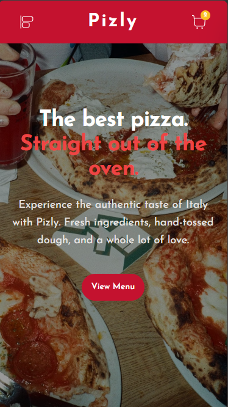
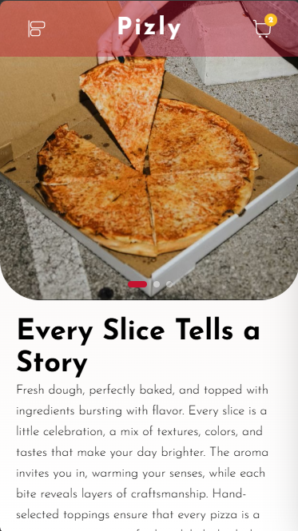
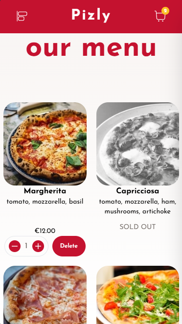
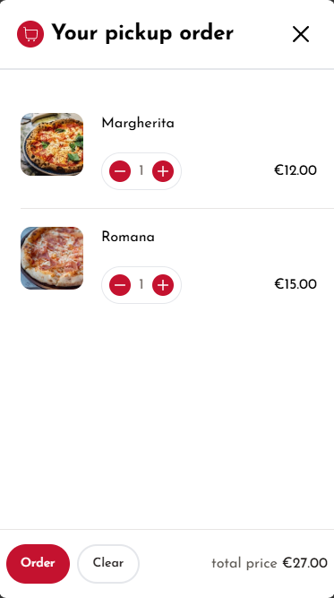
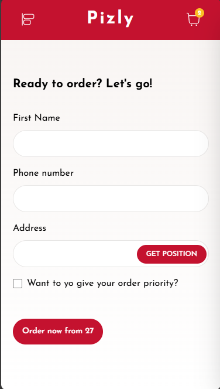
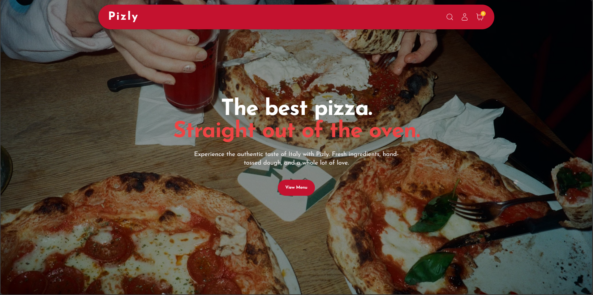
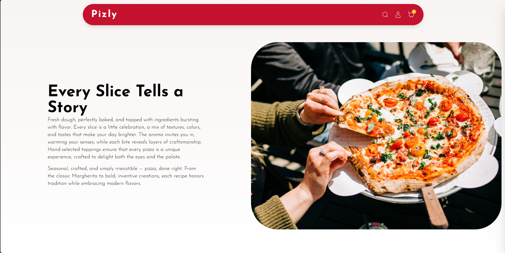
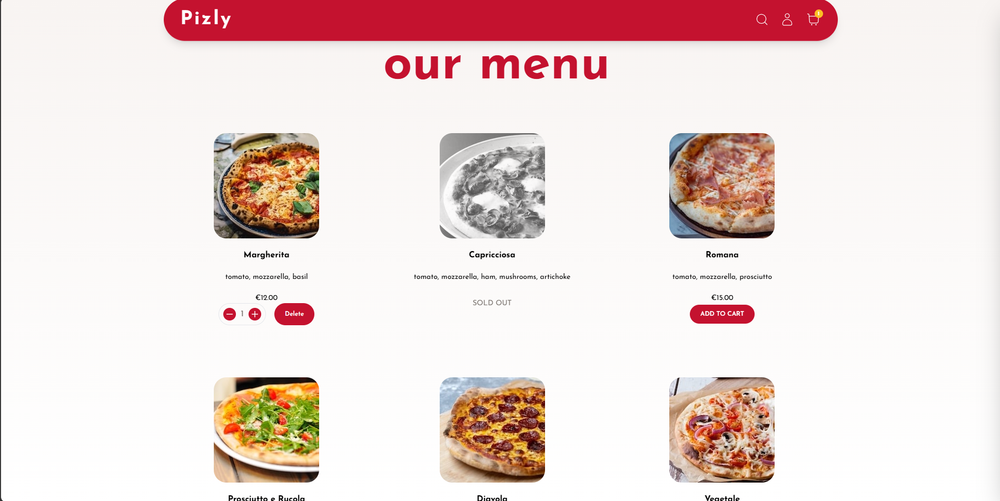
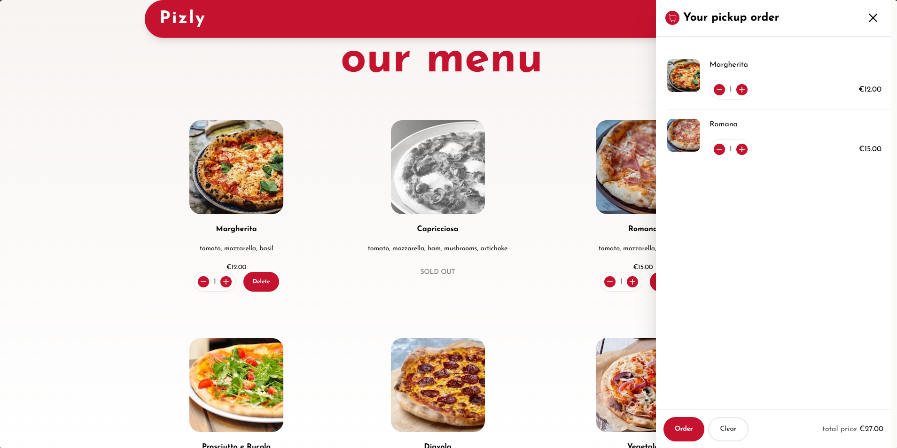
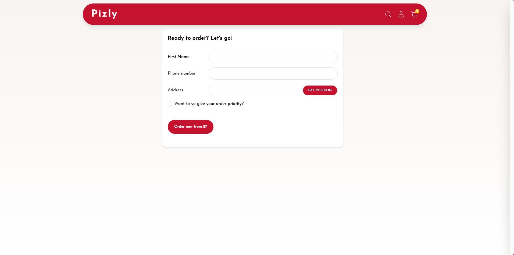

# 🍕 Pizly - Professional Pizza Delivery Experience

**🔗 [Live Demo](https://pizly.vercel.app)**

**Pizly** is a high-performance, mobile-first React application. I took a standard educational project and performed a **complete architectural and UI/UX overhaul**, transforming it from a basic training app into a professional-grade platform.

---

## 🔄 The Revamp Journey (Before vs. After)

I focused on bridging the gap between "tutorial-level" code and "production-ready" engineering.

| Feature           | Standard Version (Course Base)     | **Pizly (My Professional Version)**                               |
| :---------------- | :--------------------------------- | :---------------------------------------------------------------- |
| **Visual Design** | Basic flat UI, limited branding.   | **Premium Immersive UI** with high-res imagery and dark overlays. |
| **User Flow**     | Forced name entry before browsing. | **"Explore First" Approach** (Frictionless menu access).          |
| **Mobile UX**     | Standard responsiveness.           | **Mobile-First Optimization** using dynamic viewport units.       |
| **Shopping Cart** | Separate page, breaks flow.        | **Interactive Side-Drawer** for seamless ordering.                |

---

## 🛠️ Technical Problem Solving (Engineering Highlights)

During this revamp, I solved several critical frontend challenges:

### 📱 1. Advanced Mobile Optimization

- **The Problem:** Standard `100vh` often breaks on mobile browsers due to the dynamic address bar.
- **The Solution:** Implemented **`100dvh` (Dynamic Viewport Height)** to ensure the Hero section fits the screen perfectly on all devices.
- **Touch-Optimized UI:** Designed interactive elements to be "Thumb-friendly" for mobile users.

### 🚀 2. Layout & Performance

- **Zero Layout Shift:** Implemented `scrollbar-gutter: stable` to prevent the page from "jumping" when the shopping cart opens.
- **Memoized State:** Optimized **Redux Toolkit** selectors to ensure zero unnecessary re-renders during cart calculations.

---

## 📸 Visual Showcase

### 📱 Mobile-First Experience

> **Folder:** `/screen_shots/mobile/`

**Optimized for small screens with dynamic viewport units.**

|               **Home (100dvh)**                |                   **Brand Narrative**                    |              **Interactive Menu**              |               **Shopping Cart**                |                    **Order Form**                    |
| :--------------------------------------------: | :------------------------------------------------------: | :--------------------------------------------: | :--------------------------------------------: | :--------------------------------------------------: |
|  |  |  |  |  |

---

### 💻 Desktop Immersive Experience

> **Folder:** `/screen_shots/desktop/`

**Main Landing & Brand Story**
| **Hero Section** | **Brand Narrative (Menu Hero)** |
| :---: | :---: |
|  |  |

**Ordering Workflow & Cart**
| **Full Menu Grid** | **Shopping Cart (Sidebar)** | **Checkout Experience** |
| :---: | :---: | :---: |
|  |  |  |

---

## 🏗️ Architecture & Workflow

- **Conventional Commits:** Followed industry standards for commit messages (`feat:`, `fix:`, `refactor:`) for a professional history.
- **Clean Code:** Utilized React Context and Compound Components for complex UI elements.
- **Tech Stack:** React 18, React Router 6, Redux Toolkit, Tailwind CSS.

---

## 🚀 Getting Started

1. **Clone the repository:**
   ```bash
   git clone [https://github.com/khaled-hassan7/Pizly.git](https://github.com/khaled-hassan7/Pizly.git)
   ```
